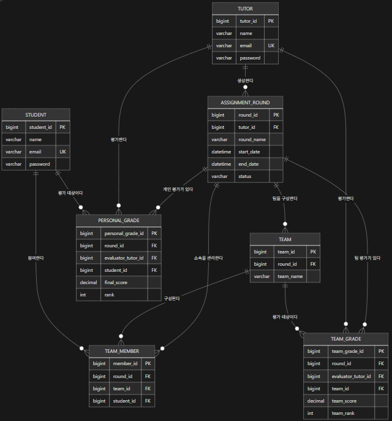

# ERD 설계 사전 정리

## 관련 BR
- 튜터는 여러 개의 과제/평가 회차를 생성할 수 있다.
- 각 과제/평가 회차는 한 명의 튜터가 생성한다.
- 하나의 회차에는 여러 팀을 구성할 수 있다.
- 학생은 여러 팀에 참여할 수 있으며, 팀에는 여러 학생이 소속될 수 있다.
- 개인 평가는 회차별·학생별로 관리한다.
- 팀 평가는 회차별·팀별로 관리한다.

## 데이터 후보

| 엔티티 후보 | 목적 | 관련 BR | 유저/제외 |
|---|---|---|---|
| STUDENT | 회원가입한 수강생 정보 저장 | 학생은 팀에 참여하고 개인 평가를 받는다. | 유저 |
| TUTOR | 회원가입한 튜터 정보 저장 | 튜터는 과제/평가 회차를 생성한다. | 유저 |
| ASSIGNMENT_ROUND | 튜터가 생성하는 과제/평가 회차 관리 | 하나의 회차는 여러 팀·개인 평가·팀 평가를 가진다. | 유저 |
| TEAM | 특정 회차의 팀 정보 저장 | 한 회차에는 여러 팀을 구성할 수 있다. | 유저 |
| TEAM_MEMBER | 학생과 팀의 소속 관계 관리 | 학생과 팀은 다대다 관계이다. | 유저 |
| PERSONAL_GRADE | 개인 평가 결과 저장 | 회차별 학생의 개인 점수와 순위를 관리한다. | 유저 |
| TEAM_GRADE | 팀 평가 결과 저장 | 회차별 팀의 점수와 순위를 관리한다. | 유저 |

## 관계 설명

- 한 평가 회차에는 여러 팀이 존재할 수 있다.
  → ASSIGNMENT_ROUND (1) : TEAM (N)

- 한 팀에는 여러 학생이 소속될 수 있다.
  → TEAM (1) : TEAM_MEMBER (N)

- 한 학생은 특정 회차에서 하나의 팀에만 소속된다.
  → TEAM_MEMBER에 `round_id`를 두고 `UNIQUE(round_id, student_id)`를 적용한다.

- 팀 평가는 평가자와 대상 팀이 필요하다.
  → TUTOR (1) : TEAM_GRADE (N), TEAM (1) : TEAM_GRADE (N)

- 개인 평가는 평가자와 대상 학생이 필요하다.
  → TUTOR (1) : PERSONAL_GRADE (N), STUDENT (1) : PERSONAL_GRADE (N)

- 중복 평가를 방지한다.
  → 팀 평가: 평가자 + 대상 팀 + 회차 조합을 유일하게 관리한다.
  → 개인 평가: 평가자 + 대상 학생 + 회차 조합을 유일하게 관리한다.

# PK 후보

| 엔티티 | PK 후보 | 이유 |
|---|---|---|
| STUDENT | student_id | 수강생을 고유하게 식별 |
| TUTOR | tutor_id | 튜터를 고유하게 식별 |
| ASSIGNMENT_ROUND | round_id | 과제/평가 회차를 고유하게 식별 |
| TEAM | team_id | 팀을 고유하게 식별 |
| TEAM_MEMBER | member_id | 팀 소속 정보를 고유하게 식별 |
| PERSONAL_GRADE | personal_grade_id | 개인 평가 결과를 고유하게 식별 |
| TEAM_GRADE | team_grade_id | 팀 평가 결과를 고유하게 식별 |

# FK 후보

| 엔티티 | FK 후보 | 참조 대상 | 이유 |
|---|---|---|---|
| ASSIGNMENT_ROUND | tutor_id | TUTOR.tutor_id | 회차를 생성한 튜터 식별 |
| TEAM | round_id | ASSIGNMENT_ROUND.round_id | 팀이 속한 평가 회차 식별 |
| TEAM_MEMBER | team_id | TEAM.team_id | 학생이 소속된 팀 식별 |
| TEAM_MEMBER | student_id | STUDENT.student_id | 팀에 소속된 학생 식별 |
| PERSONAL_GRADE | round_id | ASSIGNMENT_ROUND.round_id | 개인 평가가 진행된 회차 식별 |
| PERSONAL_GRADE | student_id | STUDENT.student_id | 개인 평가 대상 학생 식별 |
| TEAM_GRADE | round_id | ASSIGNMENT_ROUND.round_id | 팀 평가가 진행된 회차 식별 |
| TEAM_GRADE | team_id | TEAM.team_id | 평가 대상 팀 식별 |

## 유일성/중복 방지 조건

| 대상 | 조건 | 이유 |
|---|---|---|
| TEAM | UNIQUE(round_id, team_name) | 같은 회차 안에서 팀 이름이 중복되지 않도록 한다. |
| TEAM_MEMBER | UNIQUE(round_id, student_id) | 한 학생은 동일 회차에서 하나의 팀에만 소속될 수 있다. |
| PERSONAL_GRADE | UNIQUE(round_id, tutor_id, student_id) | 동일 회차에서 동일 평가자가 동일 학생을 중복 평가하지 않도록 한다. |
| TEAM_GRADE | UNIQUE(round_id, tutor_id, team_id) | 동일 회차에서 동일 평가자가 동일 팀을 중복 평가하지 않도록 한다. |

## 보완이 필요한 컬럼

| 엔티티 | 추가 컬럼 | 목적 |
|---|---|---|
| TEAM_MEMBER | round_id (FK) | 학생의 회차별 팀 소속을 검증하고, `UNIQUE(round_id, student_id)`를 적용한다. |
| PERSONAL_GRADE | tutor_id (FK) | 개인 평가의 평가자를 식별한다. |
| TEAM_GRADE | tutor_id (FK) | 팀 평가의 평가자를 식별한다. |

## ERD

## ERD 검증
| 검증 항목 | 확인 내용 | 결과 |
|---|---|---|
| 평가 회차 | 모든 평가 데이터가 회차와 연결되는가? | 통과 — `PERSONAL_GRADE.round_id`, `TEAM_GRADE.round_id`가 `ASSIGNMENT_ROUND.round_id`를 참조한다. |
| 팀 구성 | 학생의 회차별 팀을 알 수 있는가? | 통과 — `TEAM_MEMBER`의 `student_id`, `team_id`, `round_id`로 특정 회차의 학생 소속 팀을 확인할 수 있다. |
| 팀 평가 | 평가자와 대상 팀을 구분할 수 있는가? | 통과 — `evaluator_tutor_id`는 평가자, `team_id`는 평가 대상 팀을 나타낸다. |
| 개인 평가 | 평가자와 대상 학생을 구분할 수 있는가? | 통과 — `evaluator_tutor_id`는 평가자, `student_id`는 평가 대상 학생을 나타낸다. |
| BR-01 | 본인 팀을 판단할 수 있는가? | 통과 — 로그인한 학생의 `student_id`와 선택한 `round_id`로 `TEAM_MEMBER`를 조회하여 본인 팀을 확인한다. |
| BR-04 | 본인과 같은 팀원을 판단할 수 있는가? | 통과 — 본인과 동일한 `team_id`, `round_id`를 가진 `TEAM_MEMBER` 목록으로 같은 팀원을 확인한다. |
| BR-05 | 중복 평가를 판단할 수 있는가? | 통과 — 개인 평가는 `UNIQUE(round_id, evaluator_tutor_id, student_id)`, 팀 평가는 `UNIQUE(round_id, evaluator_tutor_id, team_id)`로 중복을 방지한다. |
| PK/FK | 관계가 명확한가? | 통과 — 모든 테이블에 PK가 있고, 회차·팀·학생·튜터 간 관계는 FK로 연결된다. |